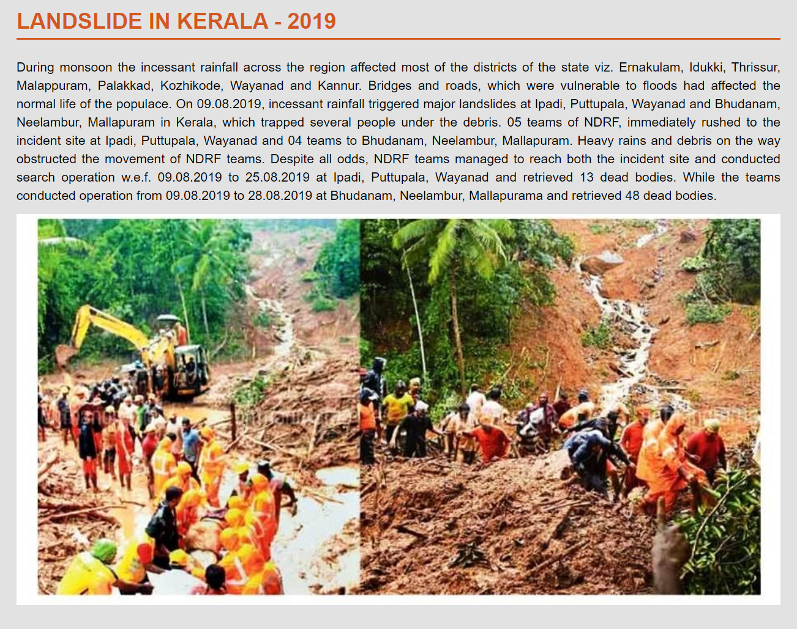

# Landslide_Alert_system(Ongoing-Project)

### Introduction
Due to frequent floods and extreme meteorological conditions, mountain regions of South India, especially Karnataka and Kerala, have been rattled by large-scale landslides that have literally washed away villages and towns. Studies have shown that the Western Ghats, with its steep slope and thick soil cover, make it the second most landslide-prone region after the Himalayas in the country. While human intervention is the primary reason, varying rainfall patterns resulting in the loosening of landmass has only added considerably to the cause. It was often argued that landslides were only reported along the Konkan coast due to railway and road widening; it has begun to strike deep inside remote areas where no works have been taken up in the past ten years. However, these areas witnessed large-scale clearing of forests to raise plantations and carry out other anthropogenic activities, resulting in landslides. Extensive quarrying in the Ghats, changes in land use, increased rubber and other plantations, and tourism where structures are being built on the slopes were also responsible for landslides. In the initial stage, the natural stability of the slope along a valley gets affected due to varied anthropogenic activities. The instability could be due to deterioration of soil resistance and change in land use, causing slope instability. These cracks begin to widen and slide when water (rain) collects in the ground, resulting in a surge of water-soaked rock, earth, and debris resulting in the final movement of the landmass. The trend of increasing incidences of landslides is expected to continue in the next decades due to urbanization, continued human activities, deforestation for various infrastructure projects, and increased regional precipitation in landslide-prone areas due to changing climatic patterns.

### Problem statement
landslide is one of the main natural disaster which causes widespread havoc around the world. With climatic changes across the globe favoring frequent occurrence of landslides, it is important that this phenomenon be studied and models be developed for predicting its occurrence.
Attempt is made to develop a model which predicts the chances of occurrence of landslide based on the data from the past with the help of various ML models. The system will work with the climate condition input the user share which will be further used by the model to match with the existing data to predict the chances of landslides.

#### Ultimate goal
1. Build a system that monitors the worldwide landslide events to understand the factors that triggered a particular landslide in a particular geography.
2. Use weather data from Kerala to understand the triggers of landslides in Kerala.
3. Build an early landslide warning system for Kerala to reduce loss of life.
